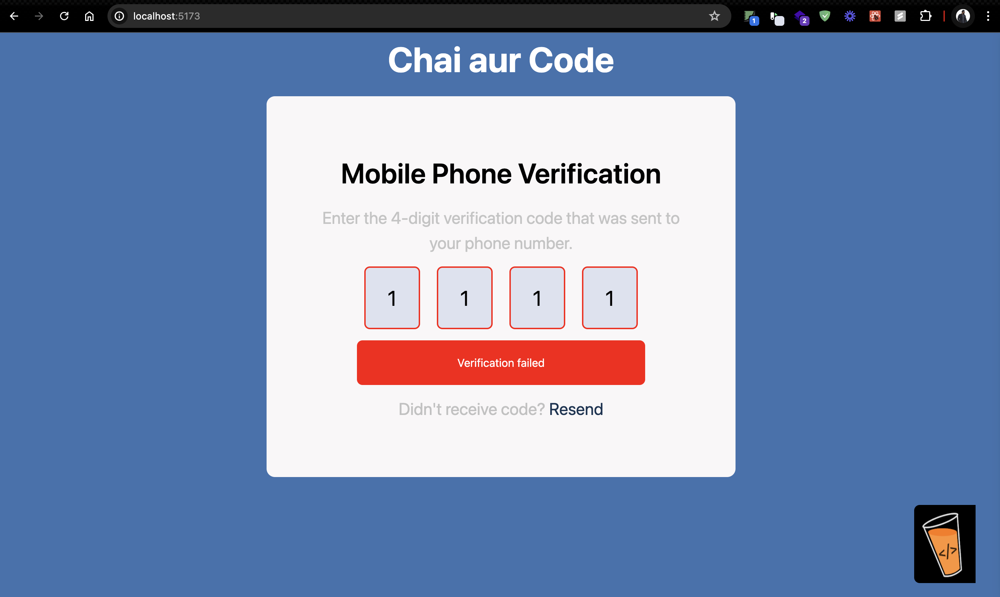

# OTP Form Application

This is a simple OTP (One Time Password) form application built with React. The application allows users to enter a 4-digit OTP sent to their phone number for verification purposes.

## Features

- User-friendly OTP input fields
- Automatic focus on the next input field
- OTP validation
- Visual feedback for successful or failed OTP verification
- Option to resend OTP

## Screenshots




## Description

The OTP Form application is designed to provide a seamless user experience for mobile phone verification. Users can enter the 4-digit OTP sent to their phone number, and the application will validate the entered OTP. If the OTP is correct, the user will see a "Verified" message with a green background. If the OTP is incorrect, the user will see a "Verification failed" message with a red background, and the input fields will be cleared for re-entry.


## How to Run the Application

1. Clone the repository:
   ```bash
   git clone https://github.com/basupatil1213/otp-form.git
   ```
2. Navigate to the project directory:
   ```bash
   cd otp-form
   ```
3. Install the dependencies:
   ```bash
   npm install
   ```
4. Start the development server:
   ```bash
   npm start
   ```
5. Open your browser and visit `http://localhost:5173` to see the application in action.

